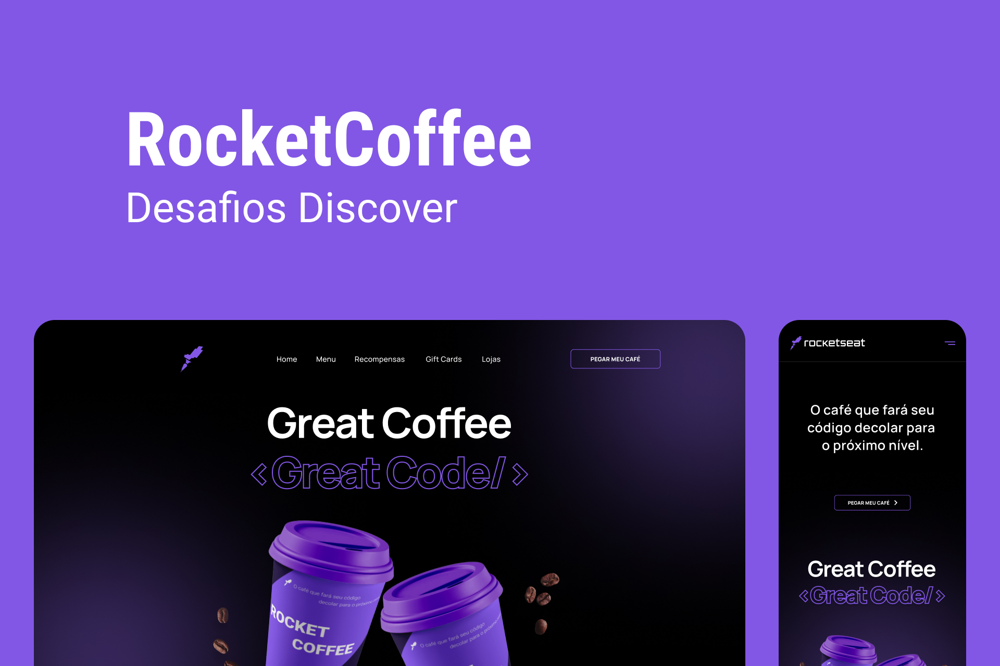

<h1 align="center">RocketCoffee</h1>

## 💻 Sobre o desafio

Nesse desafio teve que ser feito um homapage para uma marca de café

<p align="center">
  
</p>

## Requisitos para o desafio:

- Seguir o layout do Figma.
- Deixar o layout responsivo conforme o Figma.
- Na versão mobile, ao clicar no menu hamburger deverá exibir um menu responsivo conforme layout do Figma.
- Adicionar `hover` nos botões.

***Se desafie também:***

- Adicionando animações

# 🚀 **Techs**

- HTML
- CSS
- JavaScript

# 🎨 Style Guide

## **Cores:**

```css
:root {
  --backgrond: #000;
  --text-color: #FFF;
  --button: #8257E5;
  --border: #29292E;
  --border-menu-mobile: #A8A8B3;
  --text-color-menu-mobile: #E1E1E6;
}
```

## **Tipo de fonte:**

- font-family: Manrope
- font-weight: 400 e 700
- Você pode encontrar a fonte no [Google Fonts](https://fonts.google.com/)